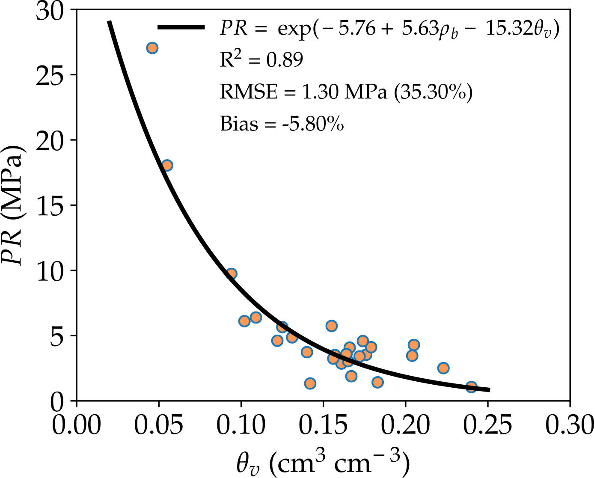
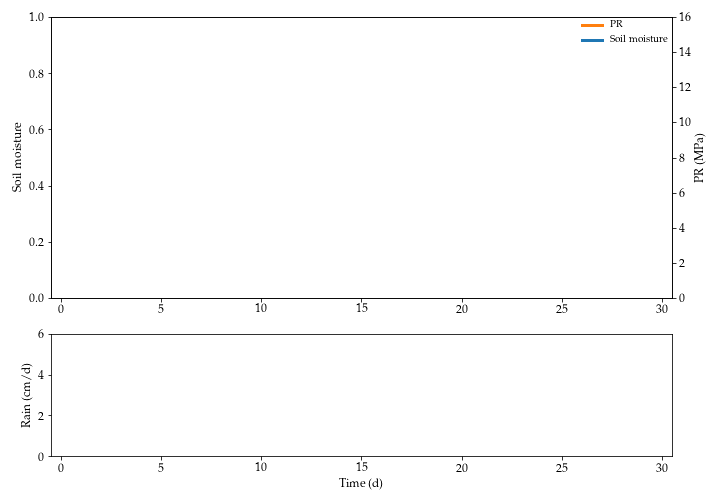

The soil penetration resistance, $PR$, is an important soil characteristic that can affect plant root growth.
However, $PR$ is not static, and it depends mainly on the soil moisture, $s$ (or $\theta_v$ if it represented as volumetric soil water content), and bulk density, $\rho_b$.
Considering that bulk density varies less than the soil moisture during the growing season, the fluctuations on PR will be related with soil moisture, which in rainfed systems, depends of the rainfall.
Although there are several equations to represent the relationship between $PR$ and soil moisture, this relation can be described as:

$$PR(\theta_v, \rho_b) = \exp(a + b \cdot \rho_b + c \cdot \theta_v)$$

Thus, $PR$ is low when soil moisture is high and it increases exponentially as soil moisture decreases.

The soil moisture can be modeled using a stochastic model:

$$n Z_r \frac{ds}{dt} = R - C_I(R) - Q(R,s) - L(s) - ET(s)$$

where $n$ is the soil porosity, $Z_r$ is the effective root depth, $s$ is the relative soil water content at time t ($s_h < s \leq 1$),
$R$ is the rain, $C_I$ is the canopy interception, $Q$ is the runoff, $L$ is the leakage, and $ET$ is the evapotranspiration.
Details of the model and parameterization is described by [Souza et al. (2021)](https://doi.org/10.1016/j.still.2020.104768).

An example of the soil moisture and $PR$ dynamics is shown below.

